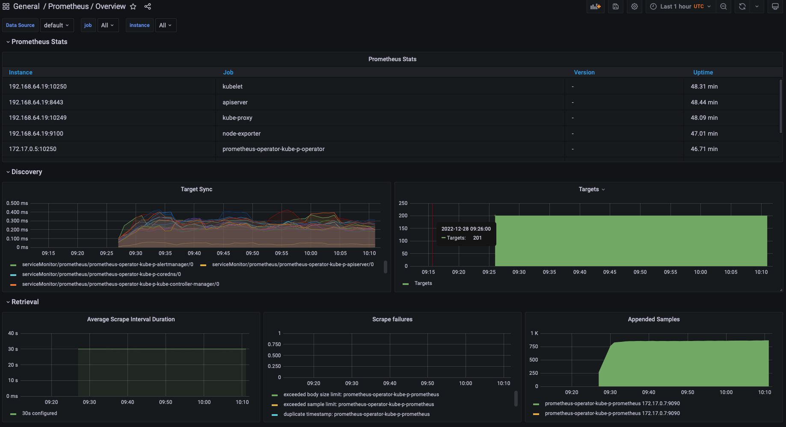
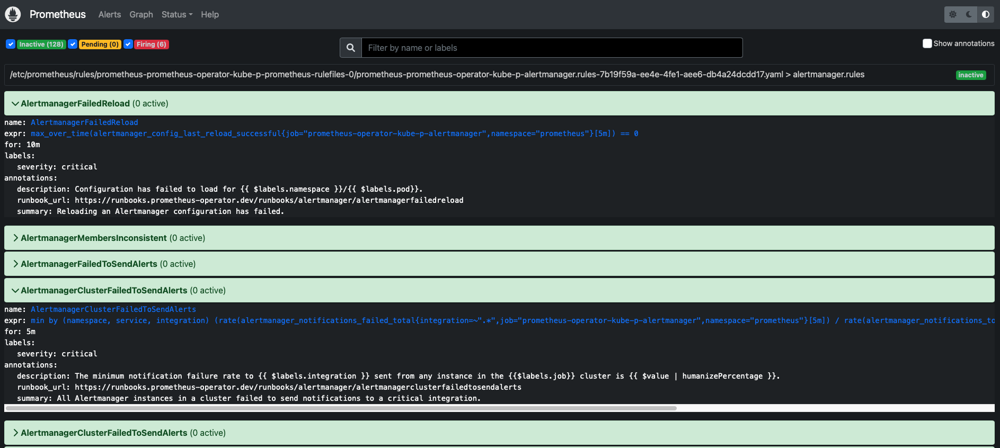
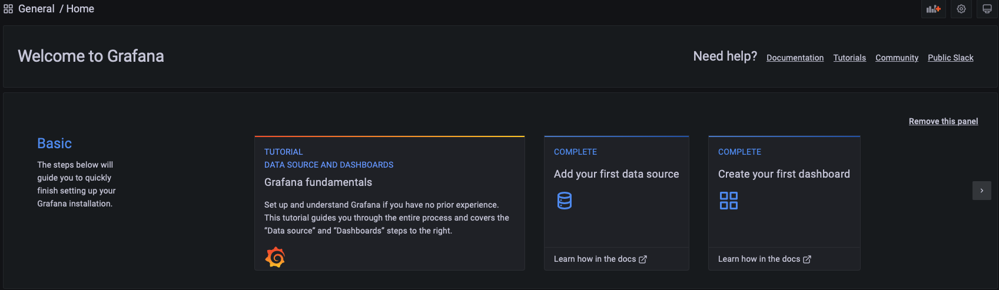
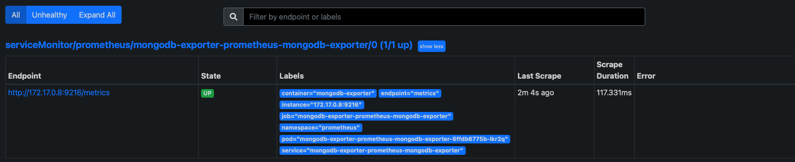

# Prometheus

#### Grafana UI


#### Prometheus UI



## About
Prometheus collects and stores its log-metrics as time series data, i.e. metrics information is stored with the timestamp at which it was recorded, alongside optional key-value pairs called labels.

## Main Components (Severs)
- Data Retrieval Worker (for Pulling metrics)
- Time Series Database (for Storing metrics)
- HTTP Server (for Accepting PromQL queries / Connect to visualizataion tools like Grafana)

## What does Prometheus monitor?
- Linux / Windows Server
- Apache Server
- Single Application
- Database Service

## Which metrics are monitored?
- CPU Status
- Memory/Disk Space Usage
- Requests Counts
- Exeptions Count
- Request Duration

## Pros and Cons
- Stand-alone and self-containing / Limits monitoring
- Reliable / Difficult to scale
- Less complex

## Prometheus + Grafana Setup

- using helm chart to deploy prometheus k8s operator
- https://github.com/prometheus-community/helm-charts

### Using helm chart operator
```bash
# run k8s cluster with enoght resources
minikube start --cpus 4 --memory 8192

# install helm cli
brew install kubernetes-helm

# add the repo
helm repo add prometheus-community https://prometheus-community.github.io/helm-charts

# search the prometheus operator
helm search repo prometheus-community

# add namespace
NS=prometheus
kubectl create namespace $NS
kubectl config set-context --current --namespace=$NS

# install the operator
helm list
helm install prometheus-operator prometheus-community/kube-prometheus-stack --namespace $NS

# check if the crds (custom resource definition) alertmanagers is installed
kubectl get crds

# check the all components
kubectl get all -n prometheus
```

### Grafana UI Setup
```bash
# check the service type. (ClusterIP = Internal Service > port-forward necessary)
kubectl get services

# check the grafana pod
kubectl get pods
POD_NAME=prometheus-operator-grafana-79f47545b6-mvwlp
kubectl describe pod $POD_NAME

# check the grafana logs and note default user and port
kubectl logs $POD_NAME -n prometheus -c grafana
USER=admin
PORT=3000

# check the deployment-name
kubectl get deployment
DEPLOYMENT_NAME=prometheus-operator-grafana

kubectl port-forward deployment/$DEPLOYMENT_NAME $PORT

# open port
http://localhost:3000

# username: admin
# password: prom-operator (adminPassword from https://github.com/prometheus-community/helm-charts/blob/main/charts/kube-prometheus-stack/values.yaml)
```



### Prometheus UI Setup
```bash
kubectl get pods
POD_NAME=prometheus-prometheus-operator-kube-p-prometheus-0

# check the port
kubectl describe pod $POD_NAME
PORT=9090
kubectl port-forward $POD_NAME $PORT
```


 
## Monitor MongoDB Service
Deploy the following components
- MongoDB App
- MongoDB Exporter (for pulling metrics)
- ServiceMonitor

```bash
# deploy mongodb app
kubectl apply -f mongodb.yaml -n prometheus

# search chart name
helm search repo prometheus-community
CHART_NAME=prometheus-community/prometheus-mongodb-exporter

# info
https://github.com/prometheus-community/helm-charts/tree/main/charts/prometheus-mongodb-exporter

# create mongodb value.yaml and overwrite setup
helm show values $CHART_NAME > values.yaml

# deploy mongodb exporter
helm install mongodb-exporter $CHART_NAME -f values.yaml

# verify chart
helm list

# check if the exporter components are created
kubectl get pod
kubectl get service
kubectl get servicemonitor

# get service name and port
kubectl get service
SERVICE_NAME=mongodb-exporter-prometheus-mongodb-exporter
PORT=9216
kubectl port-forward service/$SERVICE_NAME $PORT

# verify the metrics entpoints
http://localhost:9216

# activate prometheus ui

# open another windows 
SERVICE_NAME=prometheus-operator-kube-p-prometheus
PORT=9090
kubectl port-forward service/$SERVICE_NAME $PORT

# open the url
http://localhost:9090

```
#### now you can see exporter entpoint as target



### Check the Mongodb metrics in Grafana
```bash
kubectl get deployment
DEPLOYMENT_NAME=prometheus-operator-grafana
PORT=3000
kubectl port-forward deployment/$DEPLOYMENT_NAME $PORT
```


### clean up
```bash
kubectl config set-context --current --namespace=default
kubectl delete all --all -n prometheus
kubectl get all -n prometheus

# delete minicube
minikube delete --all
```
