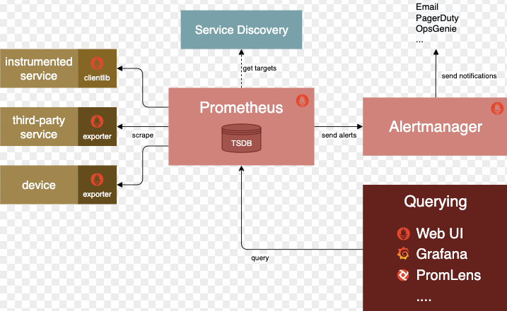

# Prometheus

## Architecture and Components

## About
Prometheus collects and stores its log-metrics as time series data, i.e. metrics information is stored with the timestamp at which it was recorded, alongside optional key-value pairs called labels.

## Getting Started

### Prometheus UI
- Demo Prometheus UI: https://demo.promlabs.com/
- Demo Proemtheus Metrics: https://demo.promlabs.com/metrics

### Concept 

`PCA.md`

### Setup Prometheus with Docker-Compose

`/simple-start`

### Setup Prometheus with Helm Chart

`/install-with-helm.md`

### Setup Grafana

`/grafana`

### Scrape Applications with Exporter

`/exporter/mongodb`

`/exporter/postgresql`

### Scrape Applications with Instrumentator

`/instrumentator/golang`

`/instrumentator/fastapi`

`/instrumentator/nodejs`

### Use Alertmanager

`/instrumentator/nodejs`

### Use Pushgateway

`/simple-start/pushgateway`

### PromQL

`/promql.md`

### Prep PCA Exam

`/PCA.md`
